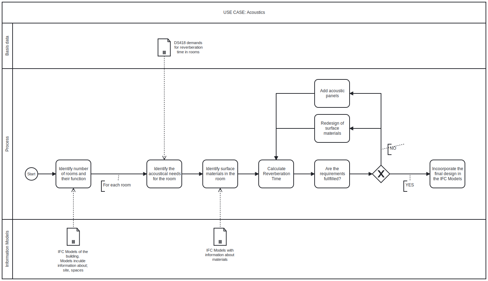

# A1-OpenBim Group12
UseCase: Acoustics

## Questions for describing the chosen UseCase

### 01 *Describe the use case you have chosen*
We have chosen acoustics as our use case. When it comes to the indoor climate in buildings and their level of comfort they bring, acoustics plays an important role. Although acoustic is important, it is often neglected when cutting budgets, because it properbly relates to a more luxeruios feature or ability than for example given fire safety. The acoustics in one room and acoustics in between rooms is primarely connected to the materials of walls, slabs, roofs, ceilings ex. Also it can largely depend on the shape of the room. When talking about acoustics it relates to both acoustics in rooms, sound insulation in between rooms and sound insulation between inside and outside the building. 

### 02 *Who is the use case for?*
The acoustics is for the users of the room and their comfortness in their home. 

### 03 *What disciplinary (non BIM) expertise did you use to solve the use case*
To evalute and possibly improve the acoustics in the model we'll need to calculate the reverberation time in one or more of the rooms. This we'll do by using Sabine's formula. The formula takes in the **Volume** of the room devided by **the surface area** times **the absorption coefficient** for the different surface materials. This calculation will give the reverberation time of the room. A *"good"* reverberation time depends on the function of the room. In an office environment it is preferred to have a low reverberation time to bring down the noises, whereas in a church a higher reverberation is wanted since this is a divine space. 

### 04 *What IFC concepts did you use in your script (would you use in your script)*
We will use certain IFC concepts to extract information about the rooms of evalutation. These informations concerns all surface areas in one or more rooms, the volume of the room/rooms and surface materials in the room/rooms. 

### 05 *What disciplinary analysis does it require?*
??? copy answer to question 03 ???

### 06 *What building elements are you interested in?*
In solving our use case we are mainly interessted in the materials and areas of walls, floors and ceilings. However we also interested in the amount of windows and doors and their areas. If we are to take it further from acoustics in rooms to sound insulation in between rooms, the whole construction of slabs and walls would be of nescecary interest.  

### 07 *What (use cases) need to be done before you can start your use case?*
The first phase about the design idea and the first draft of the building needs to be done beforehand. This also regards plan drawings of the rooms, their connections and their functions. In the next phase when the design is getting further developed, acoustics should be included, since this regards the constructions and the weight of these, which needs to be an input as an amount of load in the calculations of the structural mechanics. 
The room acoustics needs to be done in cooperation with the LCA use case, since the main interest for both of these use cases is the materials used. The indoor climate use case needs to be done before or in cooperation with acoustics, because with this use case comes the daylight analysis, and the roomboudaries, which influences the room acoustics. 

### 08 *What is the input data for your use case?*
The input data for our use case is the room bouderies, the construction materials, the amount of rooms and the functions of the rooms. 

### 09 *What other use cases are waiting for your use case to complete?*
Partly LCA awaits, but still these two use cases should be done in colaboration. In reality LCA would weight more than the room acoustics and the same applies for the indoore climate. Therefore only the digital twin awaits for our use case to complete. 

### BPMN

